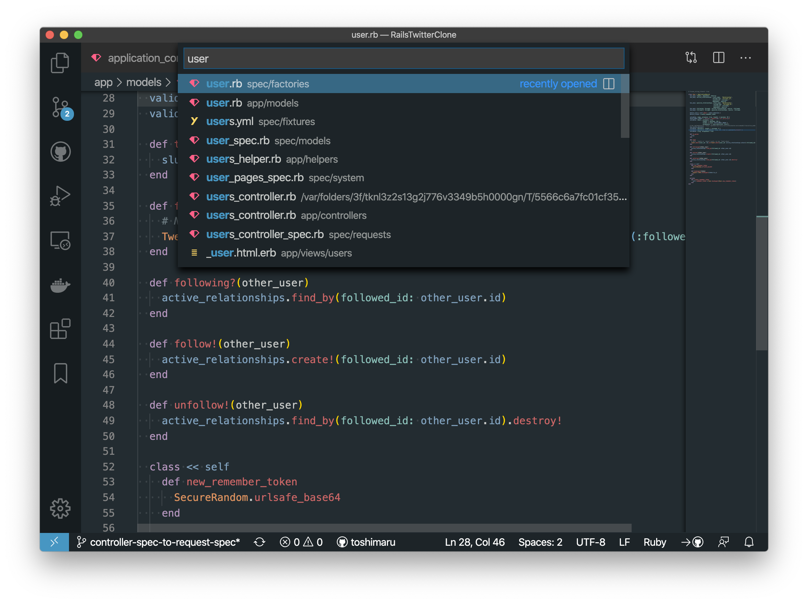

# Hybrid Next Plus

Hybrid Next Plus Theme for VS Code.

## Inspired Color Themes

### UI Color Theme

- [Atom One Dark](https://atom.io/themes/one-dark-ui) 

### Syntax Color Theme

- [vim-hybrid](https://github.com/w0ng/vim-hybrid)
- [atom-hybrid-next](https://github.com/kaicataldo/hybrid-next-syntax)
- [vscode-hybrid-next](https://github.com/wyze/vscode-hybrid-next/)
- [Base16 Tomorrow](https://github.com/o4x/base16-tomorrow-vscode)
