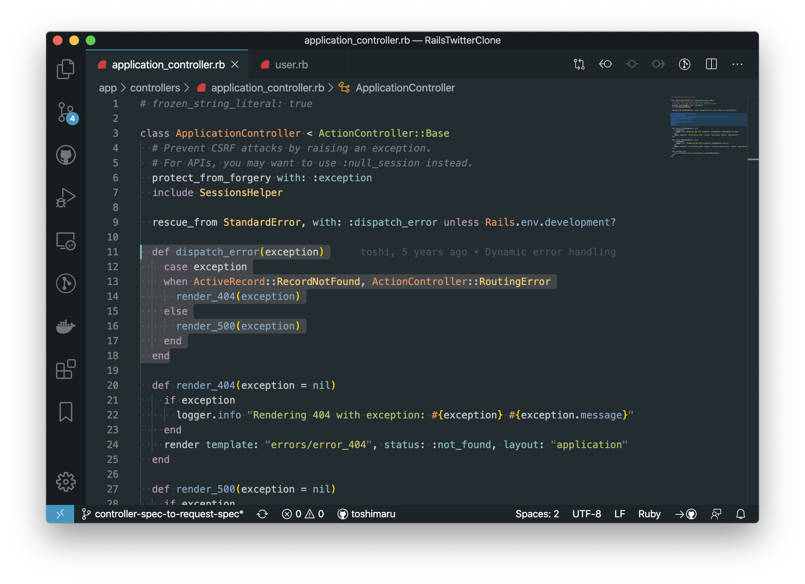

  

# Hybrid Next Plus

Hybrid Next Plus Theme for VS Code.

## Sidebar & Command Palette

## Colors

| color | hex color code |
| --- | --- |
| black (background) |  `#232c31` |
| white (foreground) |  `#c5c8c6` |
| cyan |  `#4796c2` |
| blue |  `#81a2be` |
| purple |  `#b294bb`|
| orange |  `#de935f` | 
| yellow |  `#f0c674` | 
| green |  `#b5bd68` | 
| red |  `#cc6666` |

## Inspired Themes

### UI Theme

- [Atom One Dark](https://atom.io/themes/one-dark-ui) 

### Syntax Theme

- [vim-hybrid](https://github.com/w0ng/vim-hybrid)
- [atom-hybrid-next](https://github.com/kaicataldo/hybrid-next-syntax)
- [vscode-hybrid-next](https://github.com/wyze/vscode-hybrid-next/)
- [Base16 Tomorrow](https://github.com/o4x/base16-tomorrow-vscode)

## Reference

[Theme Color | Visual Studio Code Extension API](https://code.visualstudio.com/api/references/theme-color)
